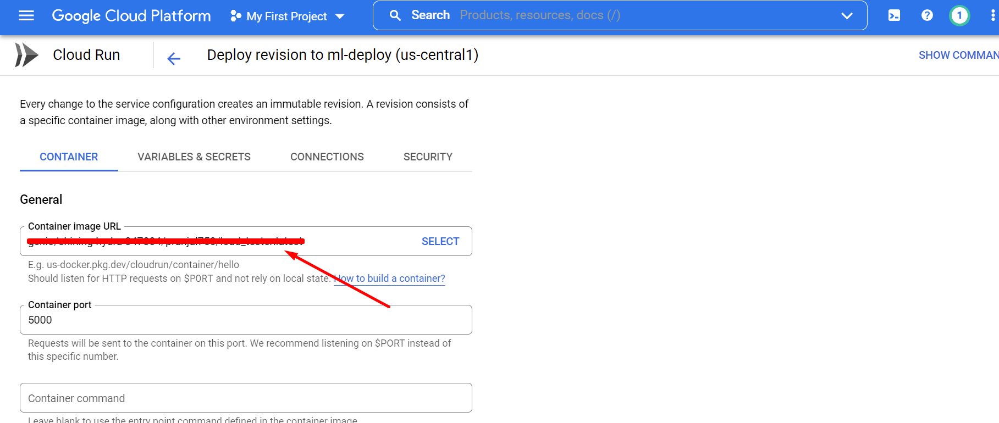

# ML_Deploy

## Steps to deploy in Cloud Run:
1. Install Google Cloud CLI and authenticate following the link [here](https://cloud.google.com/sdk/gcloud) and [here](https://cloud.google.com/sdk/docs/authorizing).
2. Build the docker image using the file: ``Dockerfile``
```
docker build .
```
3. Provide name and tag to the docker image following the instructions [here](https://cloud.google.com/container-registry/docs/pushing-and-pulling):
```
docker tag <image_id> <name>:<tag>
```
4. Push to the Google Container Registry
```
docker push <name>:<tag>
```


5. In the Cloud Run console, select ``Edit and Deploy new revision``


6. Find the link to the image that we pushed in the Google container registry and provide it in the ``Container Image URL``

7. Set Container port to ``5000``. Flask app will use 5000 port for communication.
8. Set the Memory and CPU capacity as per requirement. I used the Memory as 2GiB and CPU as 1.
9. Change other parameters as required and deploy the app.
10. Find the deployment URL after the deployment.


## Health check request
Python
```
import requests

url = "<deployment_url>"

payload={}
headers = {}

response = requests.request("GET", url, headers=headers, data=payload)

print(response.text)

```

cURL
```
curl --location --request GET '<deployment_url>'
```

Response Sample:
```
Welcome to MobileNet Flask App! OS Project 2022.
```

## Prediction request


cURL
```
curl --location --request POST '<deployment_url>' \
--header 'x-api-key: 1234' \
--form 'image=@"<image_path>"'
```

Python
```
import requests

url = "<deployment_url>/predict"

payload={}
files=[
  ('image',('car.jpg',open('<image_path>','rb'),'image/jpeg'))
]
headers = {
  'x-api-key': '1234'
}

response = requests.request("POST", url, headers=headers, data=payload, files=files)

print(response.text)
```

OR

cURL
```
curl --location --request POST '<deployment_url>' \
--header 'x-api-key: 1234' \
--form 'image="<image_url>"'
```

Python
```
import requests

url = "<deployment_url>/predict"

payload={'image': '<image_url>'}
files=[

]
headers = {
  'x-api-key': '1234'
}

response = requests.request("POST", url, headers=headers, data=payload, files=files)

print(response.text)
```

Response Sample:
```
{
    "Prediction": "sports car",
    "message": "Success"
}
```

## Locust load testing result
https://htmlpreview.github.io/?https://github.com/pranjal1/ML_Deploy/blob/main/results/locust.html
## Cloud Run analytics
https://github.com/pranjal1/ML_Deploy/blob/main/results/cloud_run.ipynb


